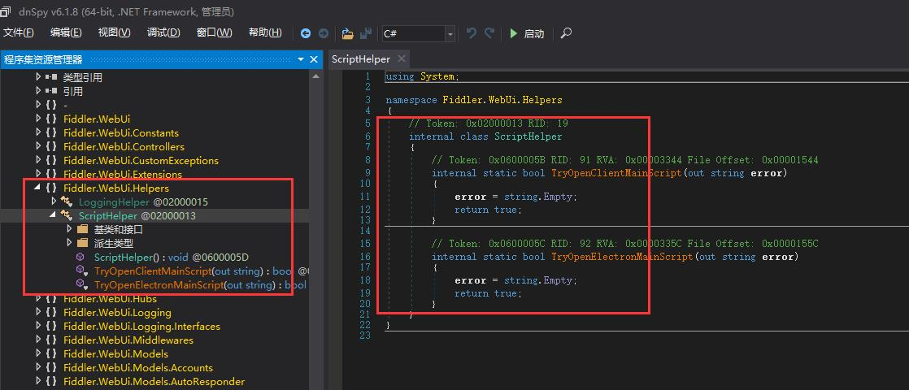

# 前言

软件都知道，不做解释；
借鉴于 [fiddle破解](https://github.com/msojocs/fiddler-everywhere-crack/) 


# 预处理 方法一

准备好 `ildasm` 与 `ilasm`

使用 `ildasm` 将 `Fiddler.WebUi.dll` 转换为 il 文件

使用 `ildasm` 将 `FiddlerBackendSDK.dll` 转换为 il 文件

然后编辑 il文件，修改下方对应处代码，再通过ilasm将 il文件编译为 dll文件，具体操作百度。
方法二同理，方法二可以直接反编译修改代码，相对来说更推荐使用方法二。

# 方法二
使用dnSpy反编译工具，打开dnSpy.exe，打开文件Fiddler.WebUi.dll和 FiddlerBackendSDK.dll 修改对应的代码块

[dnSpy地址](https://github.com/dnSpyEx/dnSpy/releases)



# 处理

## main.xxxx.js

> 为何在此进行修改？
> 
> 这是使用控制台进行调试操作探索出来的。


打开 `fiddler/resources/app/out/WebServer/ClientApp/dist/main.xxx.js` 搜索 `updateUserLicense` 

函数开始处添加：（请将 `Ie` 替换为参数名称）

```javascript
Ie.licenseInfo.currentLicense = "Pro"
Ie.licenseInfo.hasExpiredTrial = false
Ie.licenseInfo.isTrialAvailable = false
Ie.licenseInfo.hasValidLicense = true
```


## Fiddler.WebUi.il

> 如何知道修改此文件？
> 
> 当修改 `main.js` 尝试调出控制台时，程序是不能启动的，通过程序提示找到关键代码

> 修改此文件去除文件校验，
> 
> 在 3.3.0 版本开始 `main.xxx.js` 也被加入校验流程，在此之前此dll文件的修改是可选的。
> 
> 去除 `TryOpenElectronMainScript` 的校验之后，可以修改 `app/out/main.js` 调出控制台

对两个函数 `TryOpenClientMainScript` 与 `TryOpenElectronMainScript` 做相同操作：

将函数体内容修改为 直接返回 `true`

删除函数内以下代码之前的所有代码（以下代码含义为 `return true;`）

```
IL_0208:  /* 17   |                  */ ldc.i4.1
IL_0209:  /* 2A   |                  */ ret
```

## FiddlerBackendSDK.il

### method FiddlerBackendSDK.User.UserClient::GetBestAccount

删除 IL_000d - IL_0020 对应 if 语句
删除 IL_003f - IL_0040 对应 `return null;` 语句

### method '<>c__DisplayClass18_0'::'<GetBestAccount>b__0'

删除 IL_0000 - IL_0019 , 在 IL_001e 前插入 `ldc.i4.1`  (即函数体直接返回 `true` )

from ：通过dnSpy反编译的代码，为了代码返回return true；
```c#
public AccountDTO GetBestAccount(UserWithBestAccountDTO user)
{
	if (user.BestEverywhereAccountId != null)
	{
		return user.Accounts.FirstOrDefault((UserAccountDTO x) => x.Id == user.BestEverywhereAccountId.Value);
	}
	return null;
}
```
to
```c#
public AccountDTO GetBestAccount(UserWithBestAccountDTO user)
{
	return user.Accounts.FirstOrDefault((UserAccountDTO x) => true);
}
```

## 禁用更新

修改 `fiddler/resources/app/out/main.js`，搜索 `e.settingsService.get().autoUpdateSettings.disabled` 替换为 `true||e.settingsService.get().autoUpdateSettings.disabled`
